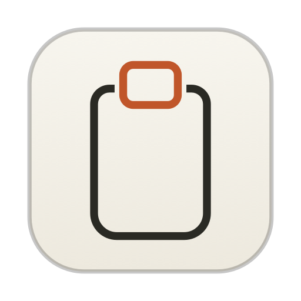
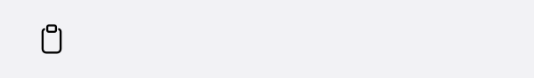

# Pastello

**The best clipboard manager for Mac: native, instant, private.**



## Why Pastello

Every clipboard manager asks you to trade something: speed for features, privacy for sync, simplicity for power. Pastello refuses the trade. It's a tiny native app, pure AppKit and SwiftUI with no Electron and no frameworks, that opens the instant you press ⇧⌘V, remembers everything you copy, and keeps all of it on your Mac. No cloud, no accounts, no telemetry, no subscription. Free and open source, and light enough that you'll forget it's running, right up to the moment you need that thing you copied an hour ago.

## Features

- **Configurable history**: text, images, and files, saved to disk and restored on every launch. Pick your limit: 25, 50, or 100 items.
- **⇧⌘V global hotkey**: summon Pastello from any app, over any window.
- **Auto-paste**: with Accessibility permission, Pastello pastes straight into the app you were using. Without it, items are still copied for you to paste with ⌘V.
- **Paste queue**: ⌘click several texts, choose "Sequentially", and ⌥⌘V pastes the next one, field after field. A floating HUD shows what's coming and how many are left.
- **Space preview**: press Space for a Quick Look-style panel, just like the Finder. Arrows keep browsing the list while the preview follows along.
- **OCR on images**: every screenshot is read locally with Apple's Vision framework. The recognized text is searchable, visible in the preview, and one click away from being copied.
- **Type filter chips**: one click to see only Text, Links, Images, Files, or Colors.
- **Pins**: keep important clips at the top; they survive cleanups.
- **Labels**: name a clip ("Project X API key") and find it instantly; labels survive re-copies of the same text.
- **Instant search**: filters as you type, across content, labels, OCR text, and source apps.
- **⌘1…⌘9**: paste any of the first nine items without touching the mouse.
- **Multi-select**: ⌘click several texts, then paste them together as one or queue them with ⌥⌘V.
- **Paste as…**: UPPERCASE, lowercase, on one line, or without spaces (perfect for IBANs and codes).
- **Smart badges**: links, emails, code, hex colors (with a live swatch), image thumbnails, files.
- **Dictation integration**: transient texts pasted by dictation apps (Myna, Wispr Flow…) are captured too, so nothing you dictate gets lost. When the dictation app restores the previous clipboard, Pastello puts the dictated text back on the clipboard, so ⌘V always pastes the latest dictation (can be turned off). And any app or Shortcut can push text straight into the history, without touching the clipboard, via the URL scheme `pastello://add?text=…&label=…&source=…`.
- **Per-app exclusions**: tell Pastello to never record copies from specific apps (Keychain Access is excluded out of the box). One click from any clip, or pick apps from a panel.
- **Privacy controls on tap**: pause capture, ignore the next copy, or delete the last 5 minutes of history.
- **Invisible popover**: the Pastello window never appears in screenshots, screen recordings, or shared screens.
- **Password-manager aware**: anything marked concealed (the `org.nspasteboard.ConcealedType` convention) is never recorded.
- **Launch at login**: one click in the gear menu.
- **Built-in updates**: a daily check against GitHub Releases, plus "Check for updates" in the gear menu. One click downloads the DMG and Pastello replaces and relaunches itself.
- **Local-only by design**: everything lives in `~/Library/Application Support/Pastello`, OCR included. No cloud, no telemetry, ever.

## A quick look




## Keyboard shortcuts

| Key | Action |
|---|---|
| ⇧⌘V | Open/close Pastello anywhere |
| ↩ | Paste the selected item |
| Space | Preview the selected item (Quick Look style) |
| ↑ ↓ | Navigate the list |
| ⌘1…⌘9 | Paste item 1…9 instantly |
| ⌥⌘V | Paste the next queued item (after "Sequentially") |
| ⌘P | Pin/unpin |
| ⌘⌫ | Delete |
| esc | Close preview, then clear search, then clear filter, then close |
| ⌘click | Multi-select (then "Paste together" or "Sequentially") |

## Install

Download the DMG from the [latest release](../../releases/latest), open it and drag Pastello to Applications.

> **Note:** the app is ad-hoc signed, so on first launch right-click Pastello and choose **Open** (or run `xattr -d com.apple.quarantine /Applications/Pastello.app`). For auto-paste, Pastello needs the Accessibility permission: gear menu → **Enable auto-paste…** and follow the prompt.

## Build from source

```bash
./build.sh
```

Requires the Xcode Command Line Tools (`swiftc`). The script compiles, signs, and produces `build/Pastello.app`; it builds in a temporary folder, so it just works wherever you clone the repo. To install:

```bash
ditto build/Pastello.app /Applications/Pastello.app
open /Applications/Pastello.app
```

## Data location

`~/Library/Application Support/Pastello/`: `history.json` plus `imgs/` for images. Nothing else, nowhere else.

### Uninstall

```bash
osascript -e 'quit app "Pastello"'; rm -rf /Applications/Pastello.app ~/Library/Application\ Support/Pastello
```

## Project structure

- `Sources/`: Swift code (AppKit + SwiftUI, no Xcode project)
  - `ClipboardStore.swift`: clipboard watching, dedup, OCR, paste queue, persistence
  - `AppDelegate.swift`: status item, popover, hotkeys, preview, auto-paste, URL scheme
  - `HistoryView.swift`: the popover UI, queue HUD, preview panel
  - `HotKey.swift`: global shortcuts via Carbon (no permissions needed)
  - `Models.swift`: item model, type detection, type filters
- `tools/makeicon.swift`: generates the icon via CoreGraphics
- `build.sh`: build + ad-hoc signing

## License

MIT © 2026 Nicola Cani
